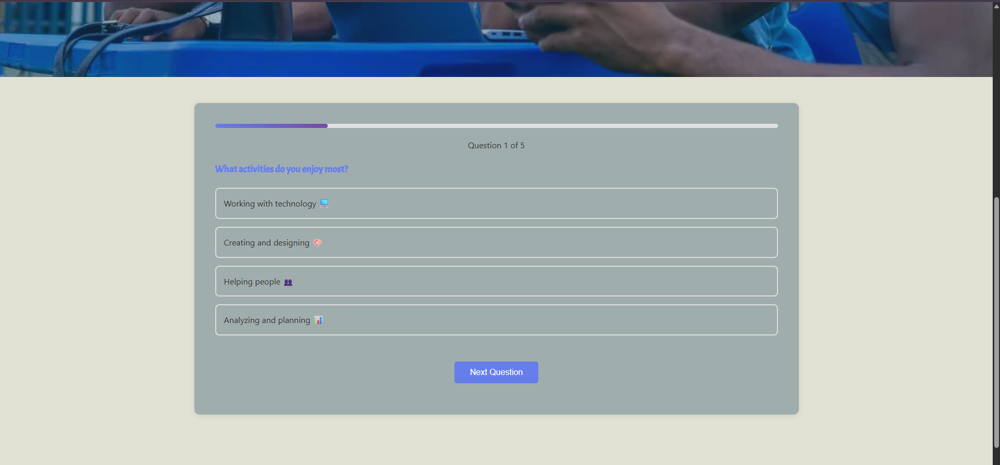
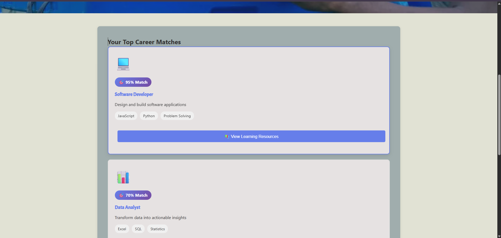
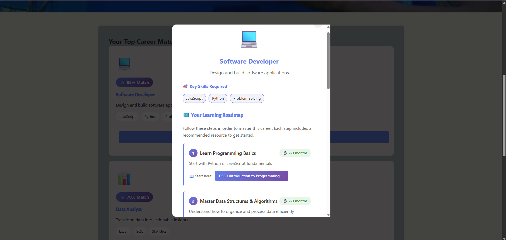

#  PathFinder AI - Career Discovery Platform


**Empowering youth to discover meaningful careers through AI-powered guidance**

---

##  Live Demo

**[Try PathFinder AI Live →](https://anne-okingo.github.io/Thinking-Wide/)**

> Replace `YOUR_LIVE_LINK_HERE` with your actual deployment link (GitHub Pages, Netlify, Vercel, etc.)

---

## Table of Contents

- [Overview](#-overview)
- [The Problem](#-the-problem)
- [Our Solution](#-our-solution)
- [Key Features](#-key-features)
- [How It Works](#-how-it-works)
- [Technologies Used](#-technologies-used)
- [Career Paths Available](#-career-paths-available)
- [Installation & Usage](#-installation--usage)
- [Project Structure](#-project-structure)
- [AI Collaboration](#-ai-collaboration)
- [Screenshots](#-screenshots)
- [Future Enhancements](#-future-enhancements)
- [Team](#-team)
- [License](#-license)

---

##  Overview

**PathFinder AI** is a free, interactive career discovery platform designed to help students and fresh graduates find their perfect career path in just 5 minutes. Through a smart quiz system and AI-powered matching algorithm, users receive personalized career recommendations complete with learning roadmaps and free resources.

###  Target Audience

- High school leavers (16-18 years)
- College and university students (18-22 years)
- Fresh graduates (0-3 years experience)
- Career changers seeking new directions
- Anyone confused about their career path

---

##  The Problem

Young people worldwide face significant career-related challenges:

### Key Statistics & Issues:

- **High Youth Unemployment**: Millions of young people struggle to find employment
- **Skills Mismatch**: 40%+ of graduates work in fields unrelated to their studies
- **Lack of Guidance**: Career counseling is expensive or unavailable
- **Information Overload**: Too many options lead to paralysis and confusion
- **Wasted Time**: Students spend years learning irrelevant skills
- **Loss of Confidence**: Uncertainty leads to anxiety and delayed career starts

### Who This Affects:

- Students unsure what career to pursue
- Graduates who studied the "wrong" field
- Youth in emerging markets with limited access to guidance
- Parents unable to afford career counseling for their children

---

## ✅ Our Solution

PathFinder AI makes career discovery **simple, personalized, and completely free**.

### What Makes Us Different:

1. ** Personalized Matching**
   - Smart quiz analyzes interests, strengths, and preferences
   - AI-powered algorithm matches users to suitable careers
   - Results based on actual job market demand

2. ** Clear Learning Roadmaps**
   - Step-by-step path from beginner to job-ready
   - Each step includes duration estimates
   - Direct links to start learning immediately

3. ** 100% Free Resources**
   - Curated links to quality learning platforms
   - No paywalls or subscriptions required
   - Resources from trusted sources (Google, Harvard, Khan Academy, etc.)

4. ** Instant Access**
   - No signup or registration needed
   - Works on any device (mobile, tablet, desktop)
   - Results in just 5 minutes

5. ** Confidence Building**
   - Reduces overwhelm through structured guidance
   - Encouraging language throughout
   - Success tips and practical advice

---

##  Key Features

### 1. Interactive Career Quiz
- **5 carefully designed questions** covering:
  - Activities and interests
  - Academic strengths
  - Work style preferences
  - Career motivations
  - Work environment preferences

### 2. Intelligent Matching Algorithm
- **Weighted scoring system**:
  - 40% Interest alignment
  - 30% Subject expertise match
  - 20% Work style compatibility
  - 10% Additional factors (demand, creativity)
- Returns top 3 career matches with percentage scores

### 3. Comprehensive Career Database
**8+ careers** across multiple categories:
-  Technology
-  Business
-  Creative
-  Healthcare
-  Management

### 4. Detailed Learning Roadmaps
Each career includes:
- 4-6 sequential learning steps
- Time estimates for each step
- Specific learning objectives
- Direct resource links to start immediately

### 5. Curated Free Resources
Every career has:
- 5+ verified free learning resources
- Mix of courses, tutorials, and tools
- Resources from trusted platforms
- Updated and relevant content

### 6. Beautiful, Interactive UI
- Modern gradient design
- Smooth animations and transitions
- Responsive across all devices
- Intuitive navigation
- Fast loading times

---

##  How It Works

### Simple 3-Step Process:

```
1️⃣ Take the Quiz
   └─ Answer 5 simple questions (5 minutes)

2️⃣ Get Matched
   └─ Receive top 3 personalized career recommendations

3️⃣ Start Learning
   └─ Follow the roadmap with free resources
```

### User Journey:

1. **Landing Page**: User learns about PathFinder AI
2. **Career Quiz**: User answers 5 questions about their preferences
3. **Results Page**: User sees top 3 career matches with scores
4. **Career Details**: User clicks to view full roadmap and resources
5. **Learning Begins**: User follows step-by-step path with linked resources

---

##  Technologies Used

### Frontend:
- **HTML5** - Semantic structure
- **CSS3** - Modern styling with:
  - CSS Grid & Flexbox for layouts
  - CSS Variables for theming
  - Animations and transitions
  - Gradient designs
- **Vanilla JavaScript** - No frameworks, pure JS for:
  - Quiz logic
  - Matching algorithm
  - DOM manipulation
  - Interactive features

### Design:
- **Google Fonts** - Syne & Outfit typography
- **Custom Gradients** - Purple & orange theme
- **Responsive Design** - Mobile-first approach

### Tools & Platforms:
- **Claude AI** - Development assistance
- **VS Code** - Code editor
- **Git & GitHub** - Version control
- **GitHub Pages / Netlify** - Deployment

---

##  Career Paths Available

| Career | Category | Skills Required | Demand Level |
|--------|----------|----------------|--------------|
|  Software Developer | Technology | JavaScript, Python, Problem Solving | Very High |
|  Data Analyst | Technology | Excel, SQL, Statistics | High |
|  Digital Marketer | Business | Social Media, SEO, Content Marketing | High |
|  Graphic Designer | Creative | Adobe Suite, Typography, Color Theory | Medium |
|  Registered Nurse | Healthcare | Patient Care, Medical Knowledge, Empathy | Very High |
|  UI/UX Designer | Creative | Figma, User Research, Prototyping | High |
|  Content Writer | Creative | Writing, Research, SEO | Medium |
|  Project Manager | Business | Leadership, Communication, Planning | High |

---

##  Installation & Usage

### Option 1: Online (Recommended)
Simply visit the [live demo link](https://anne-okingo.github.io/Thinking-Wide/) and start using immediately!

### Option 2: Local Setup

1. **Download the file**
   ```bash
   # Clone the repository
   git clone https://github.com/Anne-Okingo/Thinking-Wide.git

   ```

2. **Open in browser**
   ```bash
   # Navigate to the folder
   cd pathfinder-ai
   
   # Open the HTML file
   # On Mac:
   open thinking-wide.html
   
   # On Windows:
   start thinking-wide.html
   
   # On Linux:
   xdg-open  thinking-wide.html
   ```

3. **That's it!** No installation, no dependencies, no build process needed.

### Quick Start:
- Click "Start Career Quiz"
- Answer 5 questions honestly
- View your personalized career matches
- Click "View Learning Resources" on any career
- Follow the roadmap to start learning!

---

##  Project Structure

```
Thinking-Wide/
│
├── index.html
├──thinking-wide.css
├──thinking-wind.js     
├── README.md              
│
└──  assets/     
    └── images
```

### Code Organization (within index.html):

```html
<!DOCTYPE html>
<html>
  <head>
    <style>
      /* CSS Styles */
      - Variables
      - Base styles
      - Component styles
      - Animations
      - Responsive design
    </style>
  </head>
  
  <body>
    <!-- HTML Structure -->
    - Header
    - Home Section
    - Quiz Section
    - Results Section
    - Careers Section
    - Footer
    - Modal
    
    <script>
      /* JavaScript Logic */
      - Career data (8 careers with roadmaps)
      - Quiz questions (5 questions)
      - Quiz engine
      - Matching algorithm
      - UI interactions
      - Animation handlers
    </script>
  </body>
</html>
```

---

##  AI Collaboration

This project was built in collaboration with **Claude AI** (Anthropic). Here's how AI supported the development:

### 1. Content Creation
- Curated career database with accurate information
- Designed quiz questions for optimal matching
- Created detailed 6-step roadmaps for each career
- Compiled authentic, verified learning resources

### 2. Algorithm Development
- Built weighted scoring system for career matching
- Implemented intelligent question-to-career mapping
- Created smooth user experience flow

### 3. Design & UX
- Suggested modern gradient color schemes
- Implemented smooth animations and transitions
- Ensured accessibility and usability
- Created engaging, youth-friendly interface

### 4. Problem-Solving
- Debugged issues in real-time
- Optimized code for performance
- Improved user experience iteratively
- Added interactive features

**Key Insight**: AI didn't replace creativity - it amplified it. We focused on the vision and impact, while AI handled implementation details and research efficiently.

---

##  Screenshots

### Home Page

*Beautiful landing page with clear value proposition*

### Career Quiz

*Interactive quiz with progress tracking*

### Results

*Personalized top 3 career recommendations*

### Learning Roadmap

*Step-by-step learning path with resources*


---


---

##  License

This project is licensed under the **MIT License** - feel free to use, modify, and distribute.

```
MIT License

Copyright (c) 2024 Team PathFinder

Permission is hereby granted, free of charge, to any person obtaining a copy
of this software and associated documentation files (the "Software"), to deal
in the Software without restriction, including without limitation the rights
to use, copy, modify, merge, publish, distribute, sublicense, and/or sell
copies of the Software, and to permit persons to whom the Software is
furnished to do so, subject to the following conditions:

The above copyright notice and this permission notice shall be included in all
copies or substantial portions of the Software.

THE SOFTWARE IS PROVIDED "AS IS", WITHOUT WARRANTY OF ANY KIND, EXPRESS OR
IMPLIED, INCLUDING BUT NOT LIMITED TO THE WARRANTIES OF MERCHANTABILITY,
FITNESS FOR A PARTICULAR PURPOSE AND NONINFRINGEMENT.
```

---

##  Contributing

We welcome contributions! If you'd like to improve PathFinder AI:

1. Fork the repository
2. Create a feature branch (`git checkout -b feature/AmazingFeature`)
3. Commit your changes (`git commit -m 'Add some AmazingFeature'`)
4. Push to the branch (`git push origin feature/AmazingFeature`)
5. Open a Pull Request

---

##  Contact & Support

- **Project Repository**: [GitHub Link]
- **Live Demo**: [Live Link]
- **Report Issues**: [GitHub Issues]
- **Email**: [your.email@example.com]

---

##  Star Us!

If PathFinder AI helped you or you found it useful, please give us a  on GitHub!

---

##  Impact Goals

Our mission is to help **10,000+ young people** find career clarity in the first year.

### Current Stats:
- ✅ 8 career paths available
- ✅ 40+ free learning resources curated
- ✅ 5-minute career discovery quiz
- ✅ 100% free, no signup required

**Join us in empowering the next generation of professionals!**

---

<div align="center">

**Built with ❤️ by Team PathFinder**

*Empowering youth to discover meaningful careers*

</div>